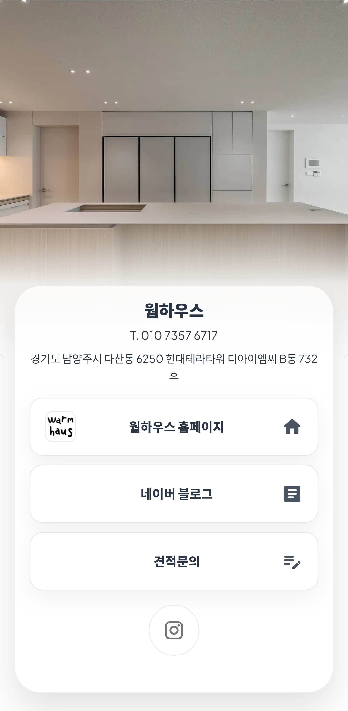
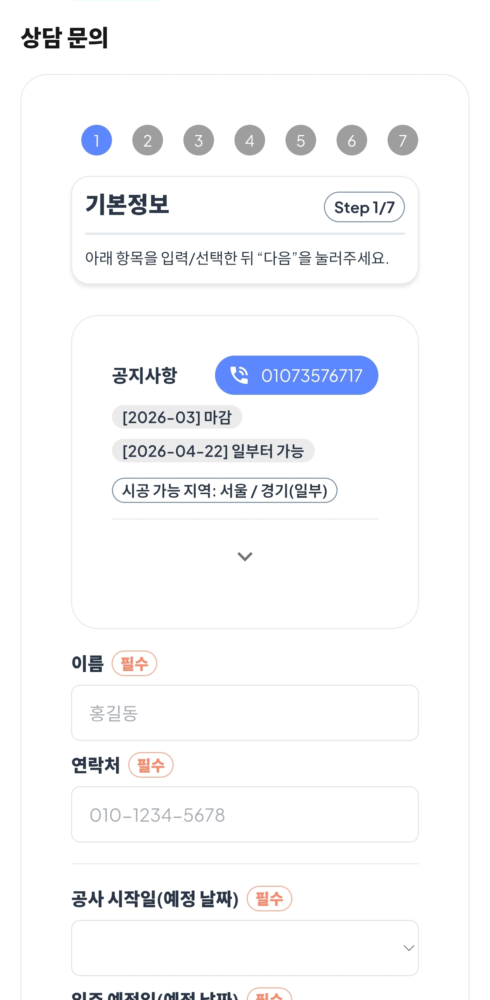
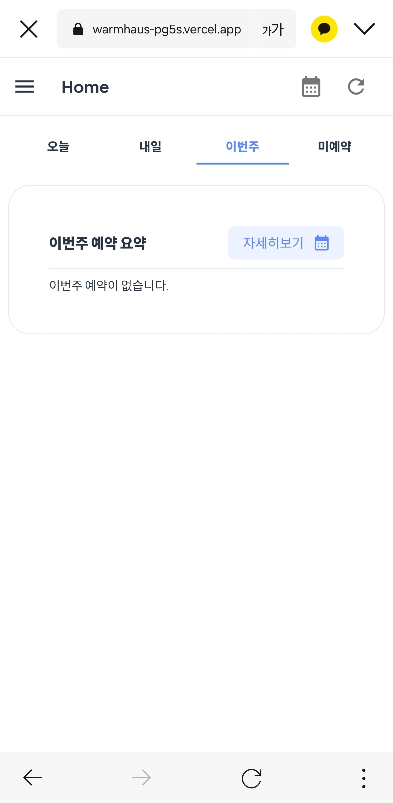
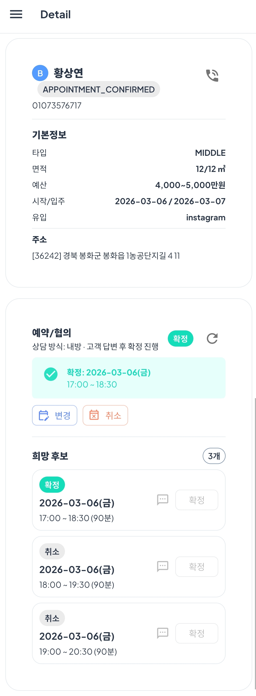
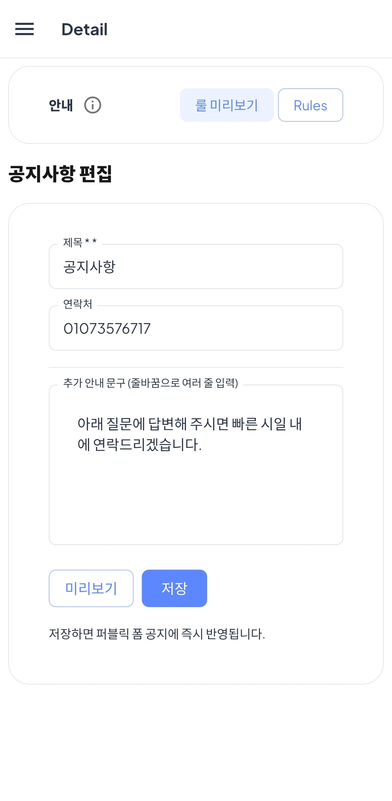
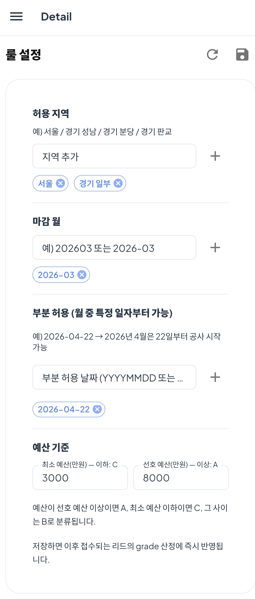
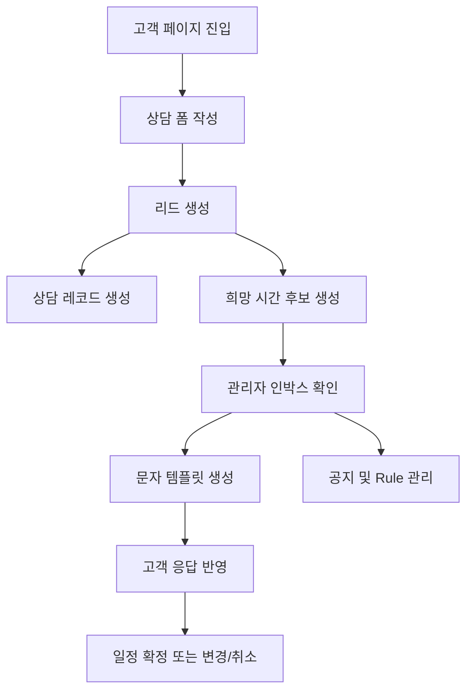

# Warmhaus Lead OS

<p align="center">
  인테리어 상담 접수, 일정 협의, 문자 템플릿 생성, 공지 및 접수 Rule 관리를 한 흐름으로 묶은 내부 운영 서비스
</p>

<p align="center">
  
  
  
  
  
</p>

<p align="center">
  <strong>고객 폼</strong> → <strong>리드 생성</strong> → <strong>상담 후보 시간 관리</strong> → <strong>문자 안내</strong> → <strong>일정 확정</strong>
</p>

---

## What Is This?

Warmhaus Lead OS는 인테리어 상담/견적 문의를 온라인 폼으로 접수한 뒤, 운영자가 리드를 검토하고 상담 일정을 협의하며 고객 안내 문구를 빠르게 생성할 수 있도록 만든 내부 업무 도구입니다.

서비스는 크게 두 축으로 구성됩니다.

- 고객 영역: 브랜드 소개, 공지 확인, 상담/견적 폼 제출
- 관리자 영역: 리드 인박스, 상담 후보 관리, 일정 확정, 공지/Rule 관리

## Highlights

- 다단계 상담/견적 폼으로 상세 공사 요구사항 수집
- 전화 상담 / 대면 상담 기준의 희망 시간 후보 관리
- 리드별 일정 상태 전이 처리
- 제안 문자, 확정 문자 템플릿 자동 생성
- 고객용 공지사항과 접수 가능 Rule 관리
- Supabase 기반 데이터 저장 및 API 처리

## Screenshots

이미지 파일은 `docs/assets/screenshots/`에 두는 기준으로 연결했습니다.

### Client Home



### Client Form



### Admin Inbox



### Lead Detail



### Admin Notice



### Admin Rules



캡처 파일이 아직 없으면 GitHub에서는 깨진 이미지로 보일 수 있습니다.  
이미지를 추가하는 즉시 README에 반영됩니다.

## Quick Start

### Install

```bash
npm install
```

### Environment

루트에 `.env.local` 파일을 준비합니다.

```env
NEXT_PUBLIC_SUPABASE_URL=
NEXT_PUBLIC_SUPABASE_ANON_KEY=
SUPABASE_SERVICE_ROLE_KEY=
ADMIN_EMAILS=
WEBHOOK_SECRET=
```

### Run

```bash
npm run dev
```

개발 서버:

```text
http://localhost:3000
```

## Core Flow



## Main Features

| 영역 | 기능 | 설명 |
| --- | --- | --- |
| 고객 접수 | 상담/견적 폼 | 주소, 예산, 공사 항목, 가구, 상담 방식, 희망 시간 수집 |
| 리드 관리 | 인박스/상세 화면 | 오늘, 내일, 이번 주, 미예약 기준으로 리드 확인 |
| 일정 협의 | 후보 시간 관리 | 고객이 입력한 희망 시간 후보의 상태 전환 |
| 문자 지원 | 템플릿 생성 | 상담 제안 문자와 확정 문자 문구 생성 |
| 운영 설정 | 공지 관리 | 고객 폼 상단 공지사항 편집 |
| 운영 설정 | Rule 관리 | 허용 지역, 마감 월, 부분 가능 일자, 예산 기준 관리 |

## Routes

| 경로 | 설명 |
| --- | --- |
| `/client` | 고객용 소개 페이지 |
| `/client/form` | 상담/견적 문의 폼 |
| `/` | 관리자 인박스 |
| `/leads/[id]` | 리드 상세 및 일정 협의 |
| `/admin/notice` | 공지사항 관리 |
| `/admin/rules` | 운영 Rule 관리 |

## Domain Model

### `leads`

- 고객 기본 정보
- 주소, 예산, 상담 방식
- 공사 요청 상세 `spec`
- 리드 상태 및 등급

### `appointments`

- 리드 단위 상담 일정의 현재 상태
- 확정, 취소, 변경 요청 등 일정 상태 관리

### `appointment_candidates`

- 고객이 선택한 희망 시간 후보
- 우선순위 및 응답 상태 관리

### `settings`

- `public_notice`
- `lead_rules`

## Appointment Lifecycle

```text
PROPOSED
  -> PENDING
  -> CUSTOMER_CONFIRMED
  -> CONFIRMED

PROPOSED
  -> PENDING
  -> CUSTOMER_DECLINED

CONFIRMED
  -> RESCHEDULE_REQUESTED
  -> CANCELED
```

## Tech Stack

| 분류 | 기술 |
| --- | --- |
| App | Next.js 16, React 19, TypeScript |
| UI | MUI 7, Emotion |
| Form | React Hook Form, Zod |
| Backend | Next.js Route Handlers |
| DB | Supabase |
| Date | Day.js |
| PWA | next-pwa |

## Project Structure

```text
app/
  (dashboard)/
    admin/
      notice/                  # 공지사항 관리
      rules/                   # 운영 Rule 관리
    leads/[id]/                # 리드 상세, 일정 협의
    page.tsx                   # 관리자 인박스
  api/
    admin/                     # 관리자 설정 API
    client/                    # 고객 폼/공지/Rule API
    leads/                     # 리드 조회 및 일정 상태 API
    appointment-candidates/    # 후보 상태 전환 API
  client/
    form/                      # 고객용 상담 폼
  components/
    admin/
    client/
lib/
  supabaseAdmin.ts
  ssr.ts
docs/
  README.md
  product-overview.md
  system-overview.md
  operations.md
  assets/
    screenshots/
```

## Documentation

- [문서 인덱스](C:/Users/chan2cha/IdeaProjects/warmhaus/docs/README.md)
- [서비스 개요](C:/Users/chan2cha/IdeaProjects/warmhaus/docs/product-overview.md)
- [시스템 구조](C:/Users/chan2cha/IdeaProjects/warmhaus/docs/system-overview.md)
- [운영 흐름](C:/Users/chan2cha/IdeaProjects/warmhaus/docs/operations.md)

## API Overview

| Method | Path | Description |
| --- | --- | --- |
| `POST` | `/api/client/leads` | 고객 폼 제출 |
| `GET` | `/api/client/notice` | 고객 공지 조회 |
| `GET` | `/api/client/rules` | 운영 Rule 조회 |
| `GET` | `/api/client/unavailable-slots` | 예약 불가 시간 조회 |
| `GET` | `/api/leads` | 리드 목록 조회 |
| `GET/PATCH` | `/api/leads/[id]` | 리드 상세 조회 및 수정 |
| `GET` | `/api/leads/[id]/appointments` | 일정/후보 조회 |
| `POST` | `/api/leads/[id]/appointments/confirm` | 일정 확정 |
| `POST` | `/api/leads/[id]/appointments/cancel` | 일정 취소 |
| `POST` | `/api/leads/[id]/appointments/reschedule` | 일정 변경 요청 |
| `POST` | `/api/appointment-candidates/[id]/pending` | 후보 대기 상태 전환 |
| `POST` | `/api/appointment-candidates/[id]/reply` | 고객 응답 반영 |
| `PATCH` | `/api/admin/notice` | 공지사항 저장 |
| `PATCH` | `/api/admin/rules` | Rule 저장 |

## Current Scope

### Included

- 고객용 다단계 상담/견적 폼
- 관리자 인박스와 리드 상세 화면
- 상담 희망 시간 후보 생성
- 후보 상태 전환과 일정 확정 흐름
- 상담 제안/확정 문자 템플릿 생성
- 공지사항 및 운영 Rule 관리

### Not Included Yet

- 실제 SMS 발송 서비스 연동
- 첨부 파일 업로드 및 스토리지 저장
- 전용 캘린더 페이지
- 정식 관리자 인증 체계
- 통계/리포트 대시보드

## Known Limitations

- 문자 발송은 현재 `sms:` 링크와 복사 기능 중심입니다.
- 첨부 파일은 UI에서 선택 가능하지만 실제 업로드 처리는 연결되어 있지 않습니다.
- `/admin/calendar` 링크는 존재하지만 연결되는 화면 구현은 없습니다.
- 관리자 권한 검증은 일부 API에만 적용되어 있습니다.
- Rule 저장 키와 리드 등급 계산 로직의 정합성은 추가 점검이 필요합니다.

## Environment Variables

| 변수명 | 설명 |
| --- | --- |
| `NEXT_PUBLIC_SUPABASE_URL` | Supabase 프로젝트 URL |
| `NEXT_PUBLIC_SUPABASE_ANON_KEY` | 클라이언트/SSR용 anon key |
| `SUPABASE_SERVICE_ROLE_KEY` | 서버 쓰기 작업용 service role key |
| `ADMIN_EMAILS` | 관리자 허용 이메일 목록 |
| `WEBHOOK_SECRET` | Google Form webhook 보호용 비밀값 |

## Recommended Next Steps

1. DB 스키마 문서를 분리해 `leads`, `appointments`, `appointment_candidates`, `settings`를 명시합니다.
2. 리드 상태값과 일정 후보 상태값을 표준화합니다.
3. 관리자 인증을 Supabase Auth 또는 별도 인증 체계로 정리합니다.
4. 캘린더 화면과 실제 문자 발송 연동을 우선 구현합니다.
5. 첨부 파일 저장소 연동을 추가합니다.

## For Who

- 프로젝트를 인수인계받는 개발자
- 운영 흐름을 문서화하려는 기획자
- 현재 구현 범위를 빠르게 파악해야 하는 협업자

## License

아직 별도 라이선스는 정의되어 있지 않습니다.
