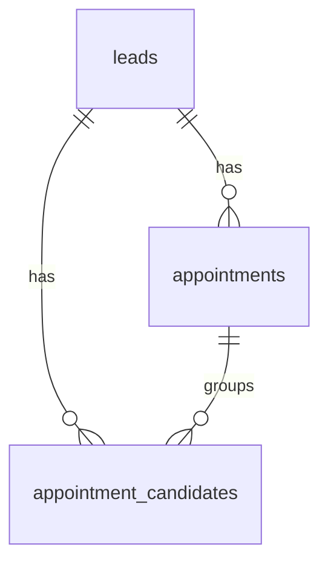

# Database Schema

이 문서는 Supabase에서 추출한 실제 SQL 스키마를 기준으로 정리한 DB 문서입니다.

기준:

- 사용자가 제공한 Supabase SQL
- 현재 저장소의 API/화면 코드

## Overview

이 프로젝트의 핵심 DB 구조는 아래 5개 테이블로 구성됩니다.

```text
leads
appointments
appointment_candidates
appointment_history
settings
```

역할은 다음과 같이 나뉩니다.

- `leads`: 고객 문의와 리드의 기준 데이터
- `appointments`: 리드 단위 현재 상담 일정
- `appointment_candidates`: 고객 또는 관리자가 제안한 상담 후보 시간
- `appointment_history`: 일정 변경 이력 로그
- `settings`: 공지와 Rule 같은 전역 설정

## ERD



참고:

- 실제 SQL상 `appointment_history`는 FK가 선언되어 있지 않지만, 의미상 `leads`, `appointments`, `appointment_candidates`와 연결되는 로그 테이블입니다.

## Tables

### `leads`

고객 문의와 운영 대상 리드의 중심 테이블입니다.

#### Columns

| 컬럼 | 타입 | Nullable | 기본값 | 설명 |
| --- | --- | --- | --- | --- |
| `id` | `uuid` | No | `gen_random_uuid()` | 리드 PK |
| `created_at` | `timestamp with time zone` | No | `now()` | 생성 시각 |
| `name` | `text` | Yes |  | 고객명 |
| `phone` | `text` | Yes |  | 연락처 |
| `type` | `text` | Yes |  | 상담/공사 유형 |
| `address_full` | `text` | Yes |  | 전체 주소 |
| `year_built` | `text` | Yes |  | 준공/연식 정보 |
| `start_date` | `date` | Yes |  | 공사 시작 희망일 |
| `move_in_date` | `date` | Yes |  | 입주 예정일 |
| `budget_raw` | `text` | Yes |  | 표시용 예산 문자열 |
| `channel` | `text` | Yes |  | 유입 채널 |
| `source` | `text` | Yes | `'google_form'` | 리드 생성 출처 |
| `grade` | `text` | Yes |  | 리드 등급 |
| `status` | `text` | Yes | `'NEW'` | 리드 상태 |
| `budget_range` | `text` | Yes |  | 예산 구간 값 |
| `zip_code` | `text` | Yes |  | 우편번호 |
| `address_road` | `text` | Yes |  | 도로명 주소 |
| `address_detail` | `text` | Yes |  | 상세 주소 |
| `plan_paths` | `ARRAY` | Yes |  | 첨부 파일 경로 배열 |
| `address_jibun` | `text` | Yes |  | 지번 주소 |
| `area_pyeong` | `text` | Yes |  | 면적 |
| `spec` | `jsonb` | Yes |  | 공사 요청 상세 |
| `consult_type` | `text` | Yes |  | `phone` 또는 `office` |

#### Constraints

- PK: `leads_pkey (id)`
- CHECK: `consult_type IN ('phone', 'office') OR NULL`

#### 코드상 사용되는 대표 상태값

```text
NEW
NO_ANSWER
CONSULT_DONE
HOLD
REJECTED
APPOINTMENT_PENDING
APPOINTMENT_CONFIRMED
APPOINTMENT_CANCELLED
APPOINTMENT_RESCHEDULE
```

#### 코드상 사용되는 대표 source 값

```text
google_form
public_form
```

#### `spec` JSON 예시

```json
{
  "extension_existing": [],
  "extension_plan": [],
  "window_work": [],
  "window_work_etc": "",
  "window_reform": [],
  "window_reform_etc": "",
  "door_frame_work": [],
  "door_frame_work_etc": "",
  "door_frame_reform": [],
  "door_frame_reform_etc": "",
  "floor_demolition": [],
  "floor_demolition_etc": "",
  "floor_work": [],
  "floor_work_etc": "",
  "molding_work": [],
  "molding_work_etc": "",
  "partition_door": [],
  "partition_door_etc": "",
  "film_work": [],
  "film_work_etc": "",
  "bathroom_work": [],
  "bathroom_work_etc": "",
  "tile_work": [],
  "tile_work_etc": "",
  "electrical_work": [],
  "electrical_work_etc": "",
  "veranda_coat": [],
  "veranda_coat_etc": "",
  "wall_finish": [],
  "wall_finish_etc": "",
  "aircon_work": [],
  "aircon_work_etc": "",
  "furniture_replace": [],
  "furniture_reform": [],
  "furniture_replace_etc": "",
  "furniture_reform_etc": "",
  "furniture_none": false,
  "plan_count": 0
}
```

### `appointments`

리드 단위 현재 상담 일정을 담는 테이블입니다.

#### Columns

| 컬럼 | 타입 | Nullable | 기본값 | 설명 |
| --- | --- | --- | --- | --- |
| `id` | `uuid` | No | `gen_random_uuid()` | 일정 PK |
| `created_at` | `timestamp with time zone` | No | `now()` | 생성 시각 |
| `updated_at` | `timestamp with time zone` | No | `now()` | 수정 시각 |
| `lead_id` | `uuid` | No |  | 리드 FK |
| `consult_type` | `text` | No | `'phone'` | 상담 방식 |
| `status` | `text` | No | `'NEGOTIATING'` | 일정 상태 |
| `start_at` | `timestamp with time zone` | Yes |  | 시작 시각 |
| `end_at` | `timestamp with time zone` | Yes |  | 종료 시각 |
| `assignee_id` | `uuid` | Yes |  | 담당자 ID |
| `memo` | `text` | Yes |  | 메모 |
| `confirmed_at` | `timestamp with time zone` | Yes |  | 확정 시각 |
| `canceled_at` | `timestamp with time zone` | Yes |  | 취소 시각 |
| `cancel_reason` | `text` | Yes |  | 취소 사유 |
| `reschedule_reason` | `text` | Yes |  | 변경 요청 사유 |

#### Constraints

- PK: `appointments_pkey (id)`
- FK: `appointments_lead_id_fkey (lead_id -> leads.id)`
- CHECK: `consult_type IN ('phone', 'office')`
- CHECK: `status IN ('NEGOTIATING', 'CONFIRMED', 'CANCELED', 'DONE', 'NO_SHOW', 'RESCHEDULE_REQUESTED')`

#### 상태값

```text
NEGOTIATING
CONFIRMED
CANCELED
DONE
NO_SHOW
RESCHEDULE_REQUESTED
```

### `appointment_candidates`

고객이 제출하거나 운영자가 제안한 상담 후보 시간을 담는 테이블입니다.

#### Columns

| 컬럼 | 타입 | Nullable | 기본값 | 설명 |
| --- | --- | --- | --- | --- |
| `id` | `uuid` | No | `gen_random_uuid()` | 후보 PK |
| `created_at` | `timestamp with time zone` | No | `now()` | 생성 시각 |
| `lead_id` | `uuid` | No |  | 리드 FK |
| `appointment_id` | `uuid` | Yes |  | 일정 FK |
| `consult_type` | `text` | No | `'phone'` | 상담 방식 |
| `source` | `text` | No | `'client'` | 후보 생성 주체 |
| `start_at` | `timestamp with time zone` | No |  | 후보 시작 시각 |
| `end_at` | `timestamp with time zone` | No |  | 후보 종료 시각 |
| `priority` | `integer` | No | `1` | 우선순위 |
| `note` | `text` | Yes |  | 메모 |
| `status` | `text` | No | `'PROPOSED'` | 후보 상태 |
| `replied_at` | `timestamp with time zone` | Yes |  | 고객 응답 시각 |
| `reply_text` | `text` | Yes |  | 고객 응답 메모 |

#### Constraints

- PK: `appointment_candidates_pkey (id)`
- FK: `appointment_candidates_lead_id_fkey (lead_id -> leads.id)`
- FK: `appointment_candidates_appointment_id_fkey (appointment_id -> appointments.id)`
- CHECK: `consult_type IN ('phone', 'office')`
- CHECK: `source IN ('client', 'admin')`

#### 코드상 사용되는 상태값

```text
PROPOSED
PENDING
CUSTOMER_CONFIRMED
CUSTOMER_DECLINED
CONFIRMED
CANCELED
```

#### source 값

```text
client
admin
```

### `appointment_history`

상담 일정 관련 이력 로그 테이블입니다.

현재 코드에서는 직접 조회/기록하는 로직이 보이지 않지만, 스키마상 존재하므로 문서에 포함합니다.

#### Columns

| 컬럼 | 타입 | Nullable | 기본값 | 설명 |
| --- | --- | --- | --- | --- |
| `id` | `uuid` | No | `gen_random_uuid()` | 로그 PK |
| `lead_id` | `uuid` | No |  | 리드 ID |
| `appointment_id` | `uuid` | Yes |  | 일정 ID |
| `candidate_id` | `uuid` | Yes |  | 후보 ID |
| `action` | `text` | No |  | 수행된 액션 |
| `reason` | `text` | Yes |  | 액션 사유 |
| `actor` | `text` | Yes |  | 수행 주체 |
| `created_at` | `timestamp with time zone` | No | `now()` | 생성 시각 |

#### Constraints

- PK: `appointment_history_pkey (id)`

주의:

- 현재 제공된 SQL에는 FK가 선언되어 있지 않습니다.
- 운영상 감사 로그 또는 상태 변경 추적용 테이블로 보는 것이 자연스럽습니다.

### `settings`

서비스 전역 설정 저장용 키-값 테이블입니다.

#### Columns

| 컬럼 | 타입 | Nullable | 기본값 | 설명 |
| --- | --- | --- | --- | --- |
| `key` | `text` | No |  | 설정 키 |
| `value` | `jsonb` | No |  | 설정 값 |
| `updated_at` | `timestamp with time zone` | No | `now()` | 수정 시각 |

#### Constraints

- PK: `settings_pkey (key)`

#### 코드상 확인된 key

```text
public_notice
lead_rules
rules
```

주의:

- 현재 코드 일부는 `lead_rules`를 사용하고, 일부는 `rules`를 읽습니다.
- 이 차이는 문서화와 코드 정리 시 우선 확인해야 하는 포인트입니다.

## Settings Value Shapes

### `settings.key = "lead_rules"`

```json
{
  "allowedRegions": ["서울", "경기 성남"],
  "closedMonths": ["2026-03", "2026-04"],
  "partialOpen": ["2026-04-22"],
  "preferredBudgetManwon": 5000,
  "minBudgetManwon": 3000
}
```

타입 정의상 아래 값도 포함될 수 있습니다.

```json
{
  "closedMonthAction": "REJECTED"
}
```

### `settings.key = "public_notice"`

```json
{
  "title": "상담 전 확인해주세요",
  "subtitle": "",
  "phone": "01012345678",
  "regionText": "시공 가능 지역 서울 / 경기(성남, 분당)",
  "openInfo": ["[2026-03] 마감"],
  "extra": ["추가 안내 문구 1", "추가 안내 문구 2"]
}
```

실제 고객 응답에서는 `lead_rules`의 일부 내용이 합쳐져 `regionText`, `openInfo`가 동적으로 보강됩니다.

## Relationships and Behavior

### 리드 생성 시

고객 폼 제출 시 보통 아래 순서가 실행됩니다.

1. `leads` 생성
2. `appointments` 생성
3. `appointment_candidates` 여러 건 생성

### 상담 방식별 후보 개수

- `phone`: 최대 2개 후보 사용
- `office`: 최대 3개 후보 사용

### 시간 저장 방식

- 고객이 입력한 한국 시간 `datetime-local` 값은 서버에서 ISO UTC로 변환 후 저장됩니다.
- DB 컬럼은 `timestamp with time zone`을 사용합니다.

## Schema Notes

### 1. `plan_paths`

`leads.plan_paths`가 실제 스키마에는 존재합니다.  
하지만 현재 코드에서는 파일 업로드 결과를 이 컬럼에 저장하지 않고, `spec.plan_count` 정도만 반영하고 있습니다.

즉, 스키마는 준비돼 있지만 기능 구현은 아직 미완성입니다.

### 2. `updated_at`

`appointments.updated_at`는 스키마에 존재합니다.  
현재 코드상에서는 명시적으로 갱신하지 않으므로 DB 트리거나 후처리가 있는지 확인이 필요합니다.

### 3. `assignee_id`

`appointments.assignee_id`는 현재 코드에서 사용 흔적이 거의 없습니다.  
향후 담당자 배정 기능 확장용 컬럼일 가능성이 높습니다.

### 4. `appointment_history`

스키마에는 존재하지만 코드상 사용이 확인되지 않았습니다.  
운영 로그를 남기려면 API 상태 전이 시 이 테이블 적재를 붙이는 것이 자연스럽습니다.

## Recommended Cleanup Points

1. `settings.key` 사용값을 `lead_rules`로 통일할지 확인
2. `plan_paths`와 실제 첨부 업로드 기능 연결
3. `appointment_history`를 상태 변경 로깅에 실제 사용
4. `leads.status` 허용값을 DB 레벨에서도 정리할지 검토
5. `appointments`와 `appointment_candidates`의 unique/index 전략 확인
