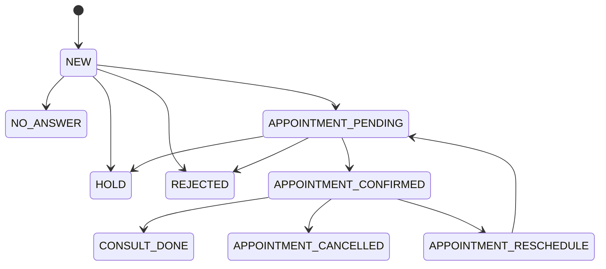
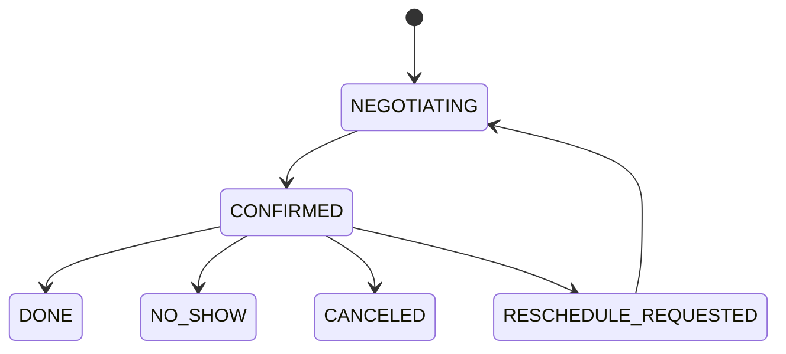
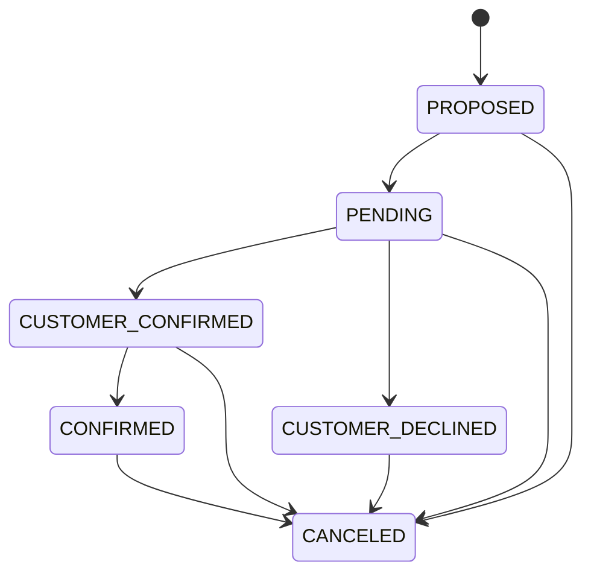

# State Machine

이 문서는 Warmhaus Lead OS에서 사용하는 상태값을 테이블별로 분리해서 정리한 문서입니다.

대상:

- `leads.status`
- `appointments.status`
- `appointment_candidates.status`

목표:

- 상태값의 의미를 명확히 한다.
- 어떤 API가 어떤 전이를 만드는지 정리한다.
- 상태 중복과 책임 분리를 점검할 수 있게 한다.

## 1. Lead Status

`leads.status`는 운영자가 리드를 어떤 단계로 보고 있는지를 나타내는 상위 상태입니다.

현재 코드상 확인되는 상태값:

```text
NEW
NO_ANSWER
CONSULT_DONE
HOLD
REJECTED
APPOINTMENT_PENDING
APPOINTMENT_CONFIRMED
APPOINTMENT_CANCELLED
APPOINTMENT_RESCHEDULE
```

## Lead Status Meaning

| 상태 | 의미 |
| --- | --- |
| `NEW` | 신규 접수 리드 |
| `NO_ANSWER` | 고객 연락 불가 또는 응답 없음 |
| `CONSULT_DONE` | 상담 완료 |
| `HOLD` | 보류 |
| `REJECTED` | 진행 제외 |
| `APPOINTMENT_PENDING` | 일정 후보 응답 대기 또는 협의 중 |
| `APPOINTMENT_CONFIRMED` | 상담 일정 확정 |
| `APPOINTMENT_CANCELLED` | 확정 일정 취소 |
| `APPOINTMENT_RESCHEDULE` | 확정 일정의 변경 요청 상태 |

## Lead Status Transition



## Lead Status Transition Sources

| 전이 | 발생 위치 |
| --- | --- |
| `NEW` 생성 | 고객 폼 제출 시 `/api/client/leads` |
| `status` 수동 변경 | `/api/leads/[id]` PATCH |
| `APPOINTMENT_PENDING` | 후보를 `PENDING`으로 변경하거나 고객 응답 반영 시 |
| `APPOINTMENT_CONFIRMED` | 일정 확정 시 |
| `APPOINTMENT_CANCELLED` | 확정 일정 취소 시 |
| `APPOINTMENT_RESCHEDULE` | 확정 일정 변경 요청 시 |

## Notes

- `leads.status`는 일정 상태를 요약해서 보여주는 성격이 강합니다.
- 따라서 `appointments.status`와 일부 중복이 생깁니다.
- 장기적으로는 “영업/운영 상태”와 “일정 상태”를 더 분리해도 됩니다.

---

## 2. Appointment Status

`appointments.status`는 리드 단위 현재 상담 일정의 상태를 나타냅니다.

코드 및 DB 스키마상 상태값:

```text
NEGOTIATING
CONFIRMED
CANCELED
DONE
NO_SHOW
RESCHEDULE_REQUESTED
```

## Appointment Status Meaning

| 상태 | 의미 |
| --- | --- |
| `NEGOTIATING` | 일정 협의 중 |
| `CONFIRMED` | 일정 확정 |
| `CANCELED` | 일정 취소 |
| `DONE` | 상담 완료 |
| `NO_SHOW` | 노쇼 |
| `RESCHEDULE_REQUESTED` | 변경 요청 상태 |

## Appointment Status Transition



## Appointment Transition Sources

| 전이 | 발생 위치 |
| --- | --- |
| `NEGOTIATING` 생성 | 고객 폼 제출 시 `/api/client/leads` |
| `NEGOTIATING -> CONFIRMED` | `/api/leads/[id]/appointments/confirm` |
| `CONFIRMED -> CANCELED` | `/api/leads/[id]/appointments/cancel` |
| `CONFIRMED -> RESCHEDULE_REQUESTED` | `/api/leads/[id]/appointments/reschedule` |

## Notes

- `DONE`, `NO_SHOW`는 스키마와 UI 타입에 존재하지만 현재 코드상 전환 API는 확인되지 않습니다.
- 변경 요청 이후 다시 `NEGOTIATING`로 돌아가는 명시 API는 없지만, 운영 흐름상 재협의 단계로 해석하는 것이 자연스럽습니다.

---

## 3. Appointment Candidate Status

`appointment_candidates.status`는 개별 후보 시간의 상태를 나타냅니다.

코드 및 DB 스키마상 상태값:

```text
PROPOSED
PENDING
CUSTOMER_CONFIRMED
CUSTOMER_DECLINED
CONFIRMED
CANCELED
```

## Candidate Status Meaning

| 상태 | 의미 |
| --- | --- |
| `PROPOSED` | 후보 생성 직후 상태 |
| `PENDING` | 고객에게 제안했고 응답 대기 중 |
| `CUSTOMER_CONFIRMED` | 고객이 해당 시간 가능하다고 응답 |
| `CUSTOMER_DECLINED` | 고객이 해당 시간 불가 응답 |
| `CONFIRMED` | 최종 확정된 후보 |
| `CANCELED` | 사용하지 않기로 정리된 후보 |

## Candidate Status Transition



## Candidate Transition Sources

| 전이 | 발생 위치 |
| --- | --- |
| `PROPOSED` 생성 | 고객 폼 제출 시 `/api/client/leads` |
| `PROPOSED -> PENDING` | `/api/appointment-candidates/[id]/pending` |
| `PENDING -> CUSTOMER_CONFIRMED` | `/api/appointment-candidates/[id]/reply` |
| `PENDING -> CUSTOMER_DECLINED` | `/api/appointment-candidates/[id]/reply` |
| `CUSTOMER_CONFIRMED -> CONFIRMED` | `/api/leads/[id]/appointments/confirm` |
| 나머지 후보 `-> CANCELED` | 일정 확정 시 자동 정리 |

## Special Recovery Cases

현재 코드에는 일반 전이 외에 복구성 전이가 존재합니다.

### 일정 취소 시

확정/대기/거절 후보들을 다시 `PROPOSED`로 복구하는 로직이 있습니다.

```text
PENDING -> PROPOSED
CUSTOMER_CONFIRMED -> PROPOSED
CUSTOMER_DECLINED -> PROPOSED
CONFIRMED -> PROPOSED
CANCELED -> PROPOSED
```

### 일정 변경 요청 시

- 기존 확정 후보는 `CUSTOMER_DECLINED`로 변경
- 기존 `CANCELED` 후보들은 `PROPOSED`로 복구

이 흐름은 “다시 협의 가능한 상태로 되돌린다”는 운영 목적에 가깝습니다.

---

## 4. Cross-Table State Mapping

실제 운영에서는 세 상태가 함께 움직입니다.

| 상황 | `leads.status` | `appointments.status` | `appointment_candidates.status` |
| --- | --- | --- | --- |
| 고객 방금 접수 | `NEW` | `NEGOTIATING` | 여러 건 `PROPOSED` |
| 후보 1개 고객 응답 대기 | `APPOINTMENT_PENDING` | `NEGOTIATING` | 1건 `PENDING` |
| 고객이 특정 시간 가능 응답 | `APPOINTMENT_PENDING` | `NEGOTIATING` | 1건 `CUSTOMER_CONFIRMED` |
| 일정 확정 | `APPOINTMENT_CONFIRMED` | `CONFIRMED` | 1건 `CONFIRMED`, 나머지 `CANCELED` |
| 일정 취소 | `APPOINTMENT_CANCELLED` | `CANCELED` | 여러 후보 `PROPOSED`로 복구 |
| 일정 변경 요청 | `APPOINTMENT_RESCHEDULE` | `RESCHEDULE_REQUESTED` | 일부 `CUSTOMER_DECLINED`, 일부 `PROPOSED` |

---

## 5. Current Gaps

현재 상태 설계에서 주의할 부분입니다.

### 1. 상위 상태와 하위 상태가 중복됨

- `leads.status`
- `appointments.status`

두 값이 모두 일정 흐름을 표현하고 있어 정합성 관리가 필요합니다.

### 2. `DONE`, `NO_SHOW` 운영 경로가 없음

스키마에는 있으나, 현재 코드에는 이 상태로 가는 API가 없습니다.

### 3. 후보 복구 로직이 일반 상태 머신보다 복잡함

취소/변경 요청 시 후보 상태를 다시 `PROPOSED`로 되돌리는 예외 흐름이 존재합니다.

### 4. 상태값 중앙 정의가 없음

상태 문자열이 API와 UI 여러 파일에 흩어져 있습니다.

---

## 6. Recommended Refactor

1. 상태값 상수를 한 곳에서 정의합니다.
2. `leads.status`는 영업/운영 관점 상태로 제한하고 일정 상태는 `appointments.status`에 집중시킵니다.
3. `DONE`, `NO_SHOW` 처리 API를 추가해 상태 정의와 구현을 맞춥니다.
4. `appointment_history`에 모든 상태 전이를 기록해 추적성을 높입니다.
5. 상태 전이 규칙을 서버 함수로 공통화해 UI와 API 간 불일치를 줄입니다.
